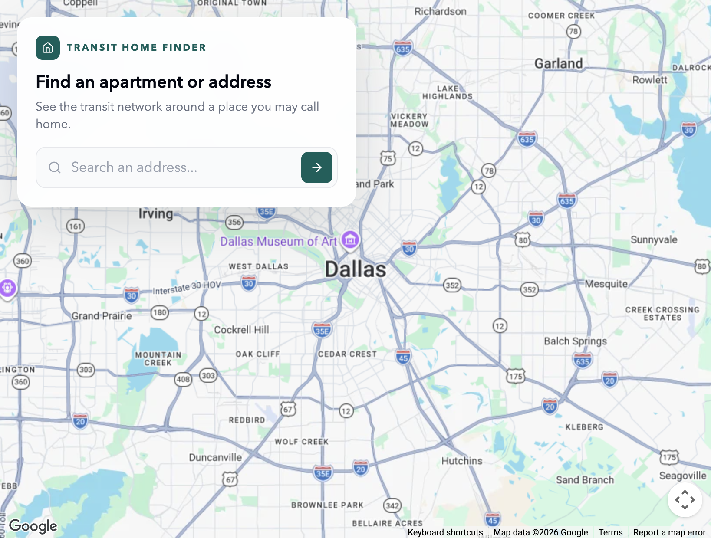
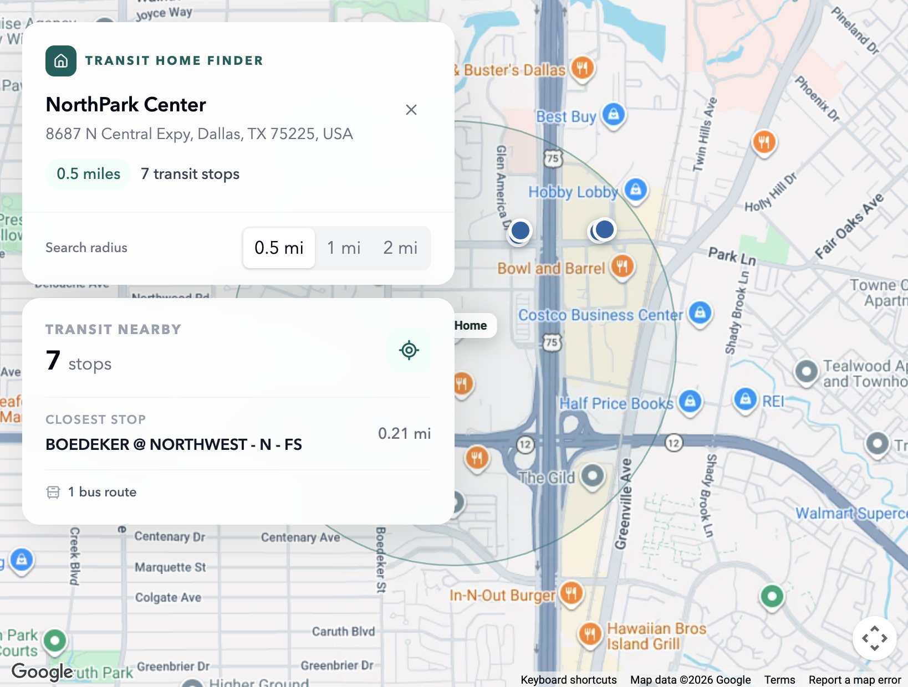
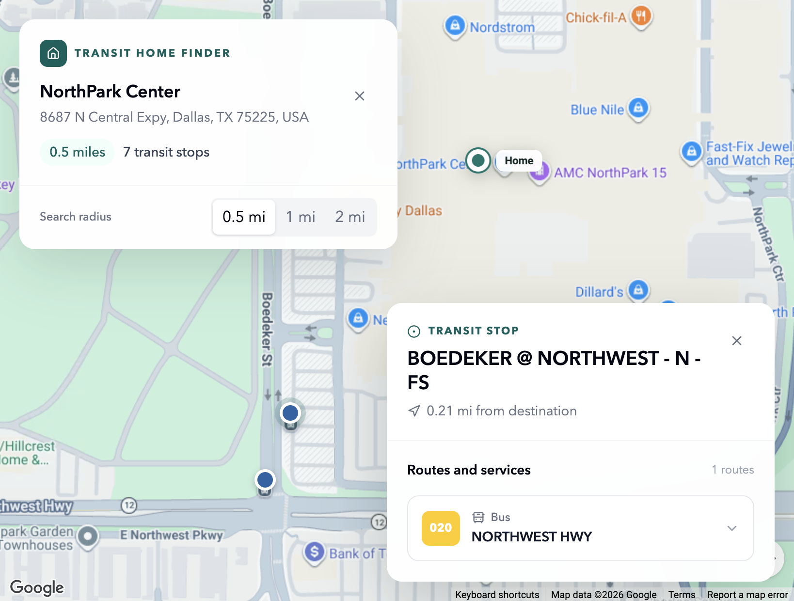
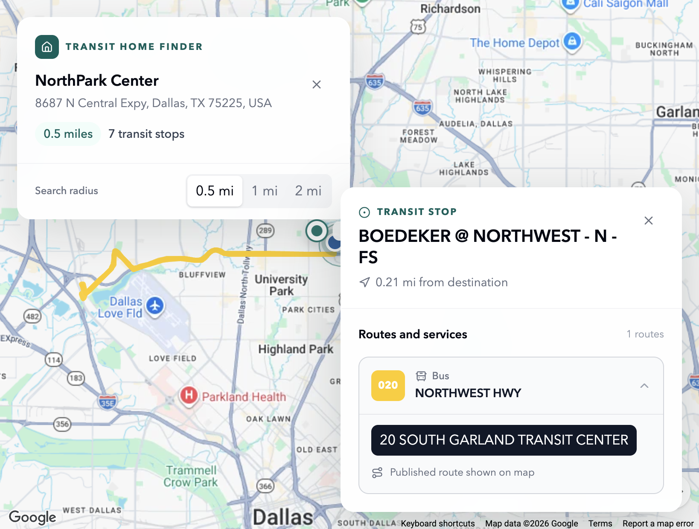

# Transit Home Finder

Transit Home Finder answers one apartment-hunting question: **how good is public transportation around this address?**

Search for a prospective home, inspect nearby DART stops, select a stop, and explore its published routes on an interactive Google Map. The experience is deliberately ordered around **address → nearby transit → stop → route**, rather than generic trip planning.

## Highlights

- Google Places address search and autocomplete
- Nearby stop discovery defaults to 0.5 miles, with 1- and 2-mile options
- Mode-aware map markers for bus, rail, and streetcar service
- Stop details with every available route and direction
- Published GTFS route geometry rendered on Google Maps
- Focus mode that keeps only the selected stop visible while a route is active
- Responsive desktop panel and mobile bottom sheet
- Bundled real DART GTFS snapshot for local development
- Optional PostgreSQL/PostGIS data source for production-scale spatial queries

## Happy-path walkthrough

### 1. Search for a prospective home



### 2. Review nearby transit



### 3. Inspect the closest stop



### 4. Explore a published route



The walkthrough uses NorthPark Center, a public commercial address in Dallas.
No home address, saved search, or personal location data is included.

## Tech stack

- Next.js 16 and React 19
- Tailwind CSS 4
- Google Maps JavaScript API and Places API
- DART static GTFS data
- PostgreSQL, PostGIS, and `pg` for the optional database-backed data source
- Supabase SSR client and session middleware

## Getting started

### Prerequisites

- Node.js 24 or newer
- A Google Maps Platform project with the Maps JavaScript API and Places API enabled
- A Supabase project for the configured session middleware

### Install

```bash
git clone https://github.com/cam1911/transit-route-finder.git
cd transit-route-finder
npm install
cp .env.example .env.local
```

Add your own development credentials to `.env.local`, then run:

```bash
npm run dev
```

Open [http://localhost:3000](http://localhost:3000). The repository includes a real DART JSON snapshot, so a database import is not required for the first local run.

Next.js records a running development server in `.next/dev/lock`. Agent tooling
should reuse the advertised URL instead of starting another server for the same
checkout.

## Environment variables

| Variable | Required | Visibility | Purpose |
| --- | --- | --- | --- |
| `NEXT_PUBLIC_GOOGLE_MAPS_API_KEY` | Yes | Browser | Google Maps browser key |
| `NEXT_PUBLIC_GOOGLE_MAP_ID` | Recommended | Browser | Google Cloud map style ID |
| `NEXT_PUBLIC_SUPABASE_URL` | Yes | Browser | Supabase project URL |
| `NEXT_PUBLIC_SUPABASE_PUBLISHABLE_KEY` | Yes | Browser | Supabase publishable key |
| `SUPABASE_DB_URL` | PostGIS only | Server secret | PostgreSQL connection string |
| `GTFS_DATA_SOURCE` | No | Server | `json` or `postgres`; automatically uses JSON when no database URL exists |
| `GTFS_FEED_URL` | No | Server | Optional GTFS feed override |

`NEXT_PUBLIC_` values are intentionally included in the browser bundle. Restrict the Google key by HTTP referrer and allow only the required Google APIs. A Supabase publishable key is designed for public clients, but it must be paired with appropriate Row Level Security. Never expose a Supabase secret/service-role key or database connection string.

## Transit data

The committed files under `data/dart/` are generated from DART's public static GTFS feed. They contain published stops, routes, and shapes, not user information.

Refresh the local JSON snapshot:

```bash
npm run import:local -- dart
```

For PostGIS-backed queries:

1. Apply `supabase/migrations/0001_gtfs.sql`.
2. Set `SUPABASE_DB_URL` in `.env.local`.
3. Import the feed with `npm run import:dart`.
4. Set `GTFS_DATA_SOURCE=postgres` to require the database source.

Imports run in a transaction and preserve GTFS extended-hour times such as `25:10:00`.
The GTFS tables are server-only: the migration enables RLS and revokes all table
privileges from Supabase's `anon` and `authenticated` roles.

## Agent and browser tooling

The repository tracks first-party Next.js and Supabase skills under
`.agents/skills/`, with exact sources recorded in `skills-lock.json`.

- Next.js 16 supplies version-matched documentation in
  `node_modules/next/dist/docs/` and maintains the marked section of `AGENTS.md`.
- `next-dev-loop` combines the development-only `/_next/mcp` endpoint with
  `agent-browser` for compilation, log, browser, and React-tree inspection.
- Playwright provides committed regression tests; `agent-browser` is for
  interactive agent exploration and debugging.
- `.mcp.json` configures the hosted Supabase MCP server in read-only
  database/documentation mode. Authenticate it through your MCP client; never
  commit an access token.

Install Chromium once after installing dependencies:

```bash
npm run browser:install
```

Run the browser suite:

```bash
npm run test:e2e
```

Run database policy tests against a local Supabase stack:

```bash
npm run db:start
npm run test:db
```

The CI workflow runs the production build, Playwright suite, local Supabase
migrations, and all pgTAP security assertions on Node 24.

## API routes

| Endpoint | Description |
| --- | --- |
| `GET /api/transit/stops/nearby` | Stops near a latitude/longitude and radius |
| `GET /api/transit/stops/:stopId` | Stop details, routes, and directions |
| `GET /api/transit/routes/:routeId` | Route metadata, shapes, and ordered stops |
| `GET /api/transit/nearby` | Legacy nearby-route search |

## Project structure

```text
app/                 Next.js pages, styles, and API routes
.agents/             Tracked first-party Next.js and Supabase agent skills
components/          Map controller and reusable transit UI
data/dart/           Generated public DART GTFS fallback
docs/screenshots/    Sanitized product screenshots
e2e/                 Playwright browser and HTTP regression tests
lib/                 GTFS and database data access
scripts/gtfs/        Feed download, validation, parsing, and import
supabase/migrations/ PostGIS schema and server-only access controls
supabase/tests/      pgTAP tests for grants and RLS
utils/supabase/      Browser/server Supabase clients and middleware
```

## Architecture

The application uses a layered architecture with one-way data flow:

```text
Google Places ──> TransitExplorer (browser state + map)
                         │ fetch
                         v
               Next.js Route Handlers
                         │ function calls
                         v
                    lib/gtfs.js
                    /         \
          bundled JSON       PostgreSQL/PostGIS
                                  ^
                                  │ import
                         GTFS parsing pipeline
```

1. **Rendering layer:** `app/layout.js` establishes the HTML shell and
   `app/page.js` renders the main feature at `/`.
2. **Client/controller layer:** `components/TransitExplorer.js` initializes
   Google Maps, owns interaction state, requests transit data, and manages map
   overlays. `components/transit/TransitUI.js` contains reusable presentational
   React components.
3. **HTTP layer:** files under `app/api/transit/` validate URL input, call the
   data layer, translate missing records and failures into HTTP status codes,
   and return JSON.
4. **Data-access layer:** `lib/gtfs.js` exposes one interface over two backends.
   Local development can read committed JSON; production can use indexed
   PostGIS queries through the shared pool in `lib/db.js`.
5. **ETL layer:** scripts under `scripts/gtfs/` download a public GTFS ZIP,
   parse its CSV files, validate relationships and coordinates, normalize IDs,
   and write either JSON or relational PostgreSQL records.
6. **Session layer:** the root proxy and `utils/supabase/` keep browser and
   server auth cookies synchronized. Transit data itself is queried server-side
   through `pg`, not through the Supabase browser client.

The main user flow is **address → coordinates → nearby stops → stop details →
route geometry**. Data becomes progressively more detailed, so the browser does
not fetch every route shape during the initial search.

## Annotated file guide

Source files include comments at architectural boundaries and around non-obvious
logic. Use this order to study the project:

| File | What to learn |
| --- | --- |
| `package.json` | npm scripts, runtime dependencies, and development dependencies. JSON does not support comments, so this table documents it instead. |
| `package-lock.json` | npm's generated, reproducible dependency graph; normally do not edit it by hand. |
| `.env.example` | Public browser configuration versus server-only secrets. |
| `.gitignore` | Which local, generated, and secret files Git must not track. |
| `next.config.mjs` | Next.js build/runtime configuration using ES modules. |
| `postcss.config.mjs` | The CSS build pipeline and Tailwind PostCSS plugin. |
| `app/layout.js` | Shared App Router document shell, global styles, and metadata. |
| `app/page.js` | The `/` route and top-level feature composition. |
| `app/globals.css` | Global design tokens, custom map marker styles, animation, responsive rules, and reduced-motion accessibility. |
| `components/TransitExplorer.js` | Client state, effects, refs, Google Maps integration, API calls, and feature orchestration. |
| `components/transit/TransitUI.js` | Prop-driven presentational components, conditional rendering, list rendering, responsive Tailwind styling, and accessibility attributes. |
| `app/api/transit/stops/nearby/route.js` | Query-string parsing, validation, async data access, and JSON responses. |
| `app/api/transit/stops/[stopId]/route.js` | Dynamic route parameters and 404 handling. |
| `app/api/transit/routes/[routeId]/route.js` | On-demand route details and explicit API response shaping. |
| `app/api/transit/nearby/route.js` | Legacy route-proximity endpoint with the same thin-handler pattern. |
| `lib/gtfs.js` | Repository/data-access pattern, backend switching, geospatial math, parameterized SQL, and row-to-domain-object mapping. |
| `lib/db.js` | Lazy singleton connection pooling and server-side configuration. |
| `scripts/gtfs/feeds.mjs` | Data-driven configuration for transit providers. |
| `scripts/gtfs/parse.mjs` | ZIP extraction and CSV parsing. |
| `scripts/gtfs/validate.mjs` | Boundary validation, uniqueness checks, and referential-integrity checks. |
| `scripts/gtfs/import-local.mjs` | In-memory joins and JSON snapshot generation. |
| `scripts/gtfs/import.mjs` | Batch inserts, transactions, advisory locks, normalization, and PostGIS geometry construction. |
| `scripts/import-dart.mjs` | A small compatibility wrapper around the reusable importer. |
| `supabase/migrations/0001_gtfs.sql` | Relational GTFS schema, foreign keys, cascading deletes, PostGIS types, and indexes. |
| `proxy.js` | Next.js 16 request interception and route matching. |
| `utils/supabase/config.js` | Shared environment validation. |
| `utils/supabase/client.js` | Supabase client factory for browser components. |
| `utils/supabase/server.js` | Request-scoped Supabase client for server code. |
| `utils/supabase/middleware.js` | Session validation and cookie refresh across request/response boundaries. |
| `data/dart/*.json` | Generated GTFS snapshots consumed by the local fallback; inspect their shape, but regenerate rather than hand-edit them. |
| `docs/screenshots/*.png` | Static documentation assets with no executable behavior. |

### Suggested learning path

For a beginner-friendly curriculum, presentation script, design rationale, and
four-week study plan, see [`docs/LEARNING_ROADMAP.md`](docs/LEARNING_ROADMAP.md).

1. Start with `app/page.js`, then follow the import into
   `components/TransitExplorer.js`.
2. Compare state (`useState`) with imperative object references (`useRef`), then
   inspect how `useEffect` connects React to Google Maps.
3. Follow one `fetch` call into its matching `app/api/` route and then into
   `lib/gtfs.js`.
4. Compare the JSON and PostGIS branches of the same data-access function.
5. Read the migration from parent tables to child tables, then follow the
   importer in the opposite direction from raw feed to those tables.
6. Finish with the request proxy and Supabase clients to understand browser/server
   boundaries and cookie-based sessions.

## Security and privacy

- `.env.local`, build output, browser artifacts, and logs are ignored by Git;
  first-party agent skills and their lockfile are intentionally tracked.
- No credentials, user records, analytics, or personal addresses are committed.
- Address searches are sent to Google Places from the browser and are not persisted by this application.
- The server-only database URL never enters the client bundle.
- GTFS tables enable RLS and deny browser roles; Next.js accesses them through a server-only PostgreSQL connection.
- Before deploying, configure Google referrer restrictions and deployment environment variables.

## Limitations

This project uses static GTFS. It visualizes published routes and stops but does not currently provide realtime arrivals, service alerts, walking directions, or end-to-end journey planning.
